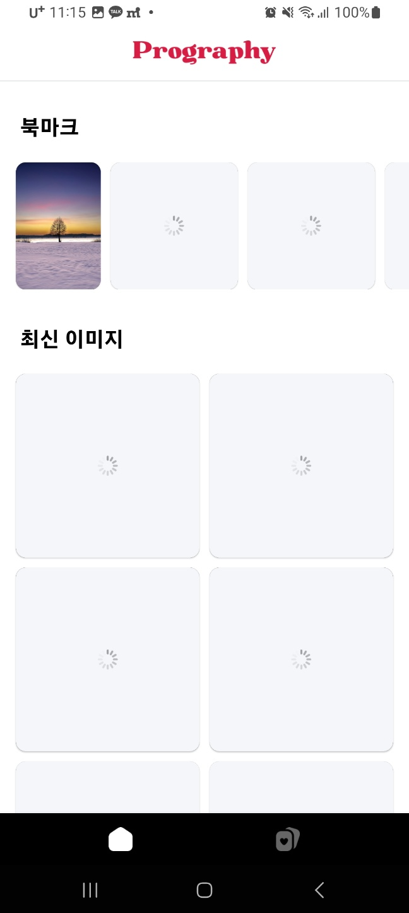
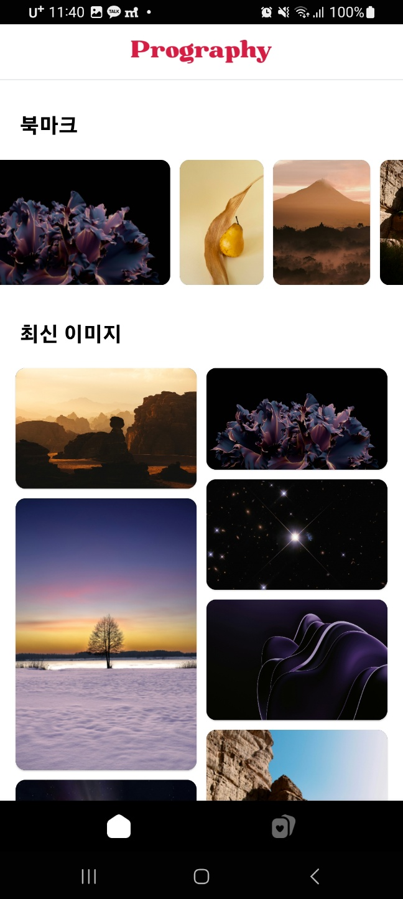
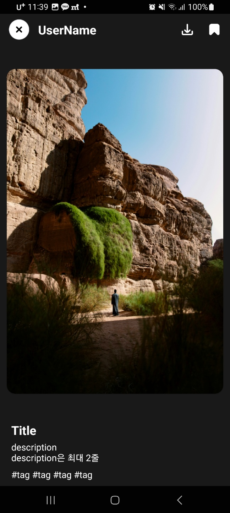
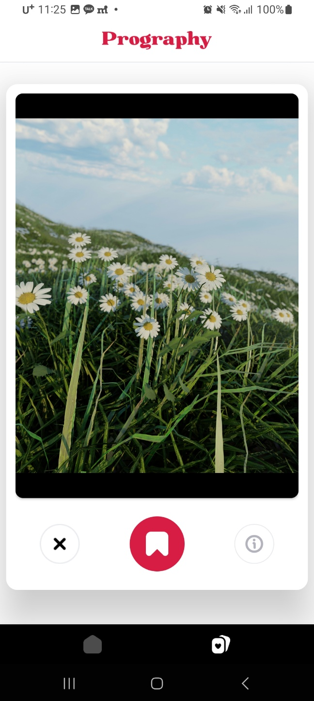

## 사용한 기술 스택
Retrofit, ViewPager2, Glide, RecyclerView, ViewBinding, navigation

## 구현 내용

### 메인

#### 북마크

1. Local DB에 북마크가 존재 하면 북마크를 보여주고 
북마크가 존재하지 않으면 북마크 세션을 보여지게 하지 않습니다.
2. 이미지 크기에 따라 다른 크기의 뷰를 보여지게 하였습니다.
3. 이미지 로딩 전까지 인디케이터가 돌아갑니다.

#### 최신 이미지

1. staggeredgridlayout 으로 높이에 따라 다른 크기의 뷰를 가집니다.
2. API 에서 url과 id 값을 받아와서 glide로 뿌려줍니다.

### 포토 디테일

1. 메인 화면에서 최신 이미지 클릭시 또는 북마크클릭시 디테일로 이동합니다.
2. 랜덤 포토에서 i 버튼 클릭시 디테일로 이동합니다.
3. 북마크 클릭시 북마크가 활성화되며 이는 영구적으로 로컬 디비에 저장되어
유지됩니다. 북마크에는 id와 url 값을 가지고 있어 id 값을 비교하여 북마크가 되어 있는지 확인합니다.
4. cancel 버튼 클릭시 이전 화면으로 돌아갑니다.
5. 이미지는 최대 사이즈까지만 늘어나고 크기에 따라 동적으로 변화합니다.

### 랜덤 포토

1. ViewPager2 가 적용되었으며 카드뷰에 적용하여 뷰를 보여줍니다.
2. 이미지를 좌우로 넘길 수 있습니다.
3. 이미지를 3회 가져옵니다.
4. 북마크 버튼 클릭시 북마크가 가능합니다.